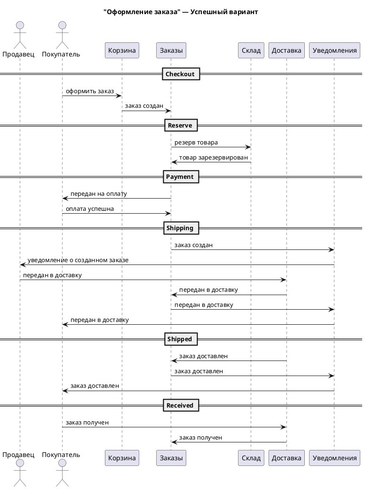
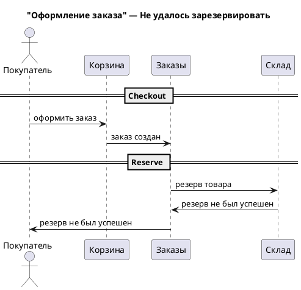
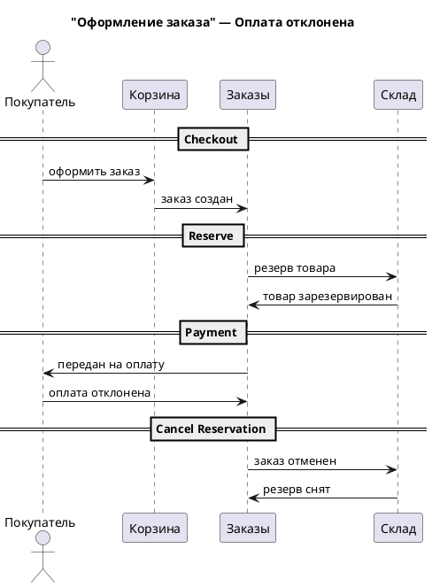
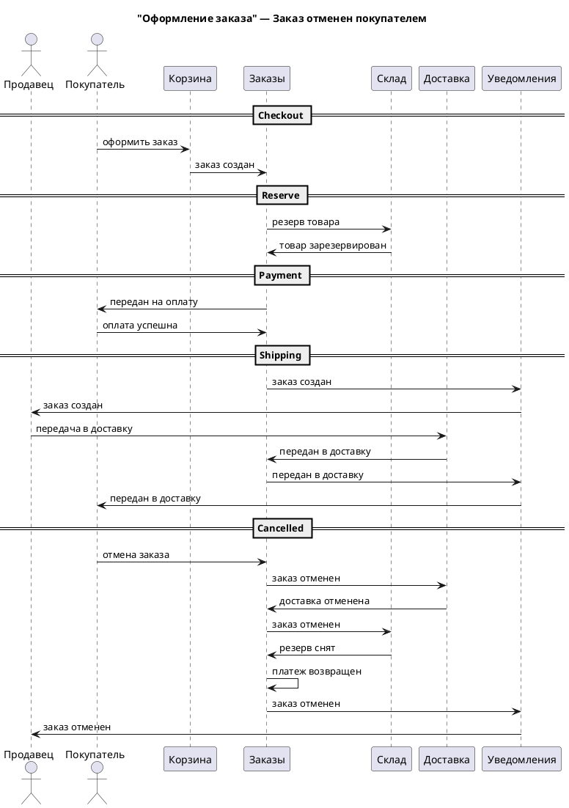

# ADR-001: MVP e-commerce приложения NovaMarket

**Статус:** ⚠️ На рассмотрении  
**Участники:** Кондрашов Михаил  
**Дата:** 10.09.2025

---

## 1. Контекст

Требуется запустить онлайн-маркетплейснуля, где продавцы размещают товары, а покупатели заказывают их с доставкой.
Для доставки компания будет использовать стороннего логистического провайдера. А на начальном этапе планируется запустить MVP, который позволит:

- покупателям просматривать каталог товаров и оформлять заказы,
- продавцам получать уведомления о новых заказах.

### Цели бизнеса

**Промежуточное состояние (через пару месяцев)**

- Запуск MVP с базовыми функциями: каталог, оформление заказа, оплата, уведомления, просмотр истории заказа.
- В качестве клиентского канала сначала будет только мобильное приложение.
- Обработка до 2500 заказов в день.
- Возможность подключить нового продавца без изменения архитектуры.
- Первые интеграции с внешними сервисами (платежный шлюз, служба доставки).

**Финальное состояние (через год)**

- Масштабирование до 40 000+ заказов в день.
- Расширение функционала: промо-акции, возвраты, программа лояльности, аналитика.
- Появление других клиентских каналов: сайт, чат-бот, встройка возможностей заказа в умных ассистентов.
- Возможность легко подключать новые сервисы по подписке на события (например, рекомендации, аналитика, антифрод).
- Подготовка к выходу на новые рынки (мультирегиональность).

Общее требование ко всем интерфейсам пользователя заключается в том, что отклик должен быть минимальным и не превышать 1 секунды в 99,99%. При этом ожидаемый показатель в 98% равен 0,3 сек.

## 2. Требования

При проектировании следует учитывать:

- возможности быстрого старта MVP,
- будущего роста (масштабирование до высоких нагрузок),
- лёгкости добавления новых сервисов.

### Описание сценариев

#### 1. Выбор товара

Покупатель заходит на платформу и видит каталог товаров. Он может:

- Просматривать список доступных товаров с актуальными ценами, названием, фотографиями и кратким описанием.
- Фильтровать товары по категориям, цене, рейтингу.
- Открыть подробную карточку товара.
- Ознакомиться с отзывами других покупателей.

Если покупатель заинтересован, он добавляет товар в корзину, но пока не оформляет заказ.

С точки зрения бизнеса важно, чтобы информация о товарах была точной и актуальной – особенно наличие и цена. Покупатель принимает решение о покупке на основе этих данных, поэтому любые несоответствия (например, товар есть в каталоге, но отсутствует на складе) снижают доверие.

#### 2. Оформление заказа

Когда покупатель решил купить выбранные товары, он открывает корзину и начинает оформление.

- **Шаг 1. Подтверждение состава заказа**
  - Покупатель проверяет список товаров, их количество, цену и итоговую сумму.
  - Указывает адрес доставки и выбирает способ получения (курьер, самовывоз, пункт выдачи).
  - Выбирает способ оплаты.
- **Шаг 2. Проверка и резервирование товаров**
  - После подтверждения заказа система проверяет, доступны ли товары в нужном количестве.
  - Если всё в наличии, товар резервируется на складе, чтобы его не купил кто-то другой.
- **Шаг 3. Оплата**
  - Покупатель перенаправляется на платёжную страницу, где вводит данные карты или выбирает другой способ оплаты.
  - Также покупатель может привязать карту, и тогда все последующие оплаты должны осуществляться автоматически
  - Деньги либо успешно списываются, либо операция отклоняется (например, из-за недостатка средств).
  - Если платёж успешен, заказ переходит в следующий этап. Если нет, он отменяется.
- **Шаг 4. Подготовка к доставке**
  - После успешной оплаты формируется заявка на доставку, где указывается адрес, получатель и список товаров.
  - Заявка отправляется в логистическую службу (внутреннюю или внешнюю).
  - Продавец получает уведомление, что нужно подготовить товар к отправке.

Для бизнеса важно, чтобы оформление заказа было быстрым, удобным и прозрачным для покупателя. При этом нужно гарантировать, что заказ будет выполнен: если покупатель оплатил товар, он должен быть зарезервирован и доставлен.

---

## 3. Решение

Для реализации первого сценария следует ввести отдельный сервис каталога, который как раз обеспечит функционал поиска, фильтрации и просмотра товаров. Также, в качестве MVP, можно считать функциональность отзывов частью каталога, однако в будущем можно вынести ее в отдельный сервис.

Пользователи будут добавлять интересующие товары в корзину (которая также будет отдельным сервисом), после чего будут переходить к оформлению заказа.

Процесс оформления заказа будет оркестрироваться сервисом заказов. Он будет отвечать за запрос резерва товаров на складе (тоже отдельный сервис, который будет отслеживать, какие, где и сколько товаров в наличии), за передачу заказа на оплату (в качестве MVP предлагается использовать внешнюю систему платежей, однако это также может быть отдельным сервисом), и за передачу в доставку (также отдельный сервис, который отвечает за общение с внешней системой логистики). Кроме того сервис управления заказов будет также управлять уведомлениями (также отдельный сервис), которые будут отправляться заинтересованным лицам.

Кроме того необходим сервис для пользователей, их регистрации, логина, доступов, аутентификации и авторизации.

```plantuml
@startuml C2 Container Context
!include https://raw.githubusercontent.com/plantuml-stdlib/C4-PlantUML/master/C4_Container.puml

Boundary(identity, "Идентификация"){
    Container(identity_service, "Сервис идентификации", "Keycloack", "Аутентификация, авторизация, регистрация, логин и учет пользователей")
    ContainerDb(identity_db, "БД идентификации", "PostgreSQL")
    Rel(identity_service, identity_db, "Read/Write")
}

Boundary(catalog, "Каталог"){
    Container(catalog_service, "Сервис каталога", "ASP.NET.Core", "Просмотр и поиск товаров, а также добавление, изменение и удаление товаров")
    ContainerDb(catalog_db, "БД каталога", "PostgreSQL")
    Rel(catalog_service, catalog_db, "Read/Write")
}

Boundary(cart, "Корзина"){
    Container(cart_service, "Сервис корзины", "ASP.NET.Core", "Управление корзиной пользователя")
    ContainerDb(cart_db, "БД корзины", "Redis")
    Rel(cart_service, cart_db, "Read/Write")
}

Boundary(ordering, "Заказы"){
    Container(ordering_service, "Сервис оформления заказов", "ASP.NET.Core", "Оформление и обработка заказов")
    ContainerDb(ordering_db, "БД сервиса заказов", "EventStoreDB")
    Rel(ordering_service, ordering_db, "Read/Write")
}

Boundary(shipping, "Доставка"){
    Container(shipping_service, "Сервис доставки", "ASP.NET.Core", "Управление доставкой товара")
    ContainerDb(shipping_db, "БД сервиса заказов", "PostgreSQL")
    Rel(shipping_service, shipping_db, "Read/Write")
}

Boundary(inventory, "Склад"){
    Container(inventory_service, "Сервис склада", "ASP.NET.Core", "Управление наличием товара, резервирование и инвентаризация")
    ContainerDb(inventory_db, "БД сервиса заказов", "PostgreSQL")
    Rel(inventory_service, inventory_db, "Read/Write")
}

Boundary(notifications, "Уведомления"){
    Container(notification_service, "Сервис уведомлений", "ASP.NET.Core", "Отправка уведомлений (Push, email)")
    ContainerDb(notification_db, "БД сервиса уведомлений", "PostgreSQL")
    Rel(notification_service, notification_db, "Read/Write")
}

Container(gateway, "API Gateway")
   
ContainerQueue(messageBus, "Брокер сообщений", "Kafka")

System_Ext(paymentGateway, "Платежный шлюз")
System_Ext(logistics, "Логистическая система")
System_Ext(email_server, "Mail сервер")

Rel_D(gateway, identity, "Аутентификация, авторизация", "REST")
Rel_D(gateway, catalog, "Получение информации о продуктах, поиск и фильтрация", "GraphQL")
Rel_D(gateway, cart, "Добавление покупок в корзину, просмотр корзины", "REST")
Rel_D(gateway, ordering, "Оформление и отслеживание заказа", "REST")
Rel_D(gateway, notifications, "Настройка получения уведомлений", "REST")

Rel_D(catalog, messageBus, "События изменения каталога товаров")
Rel_U(messageBus, cart, "События изменения каталога товаров, события изменения товаров на складе")

Rel_D(ordering, messageBus, "События изменения статуса заказа")
Rel_U(messageBus, ordering, "События изменения статуса заказа")

Rel(cart, ordering, "Оформление заказа")
Rel(ordering, inventory, "Резервирование товара")
Rel_D(inventory, messageBus, "События увеличения и уменьшения количества товаров ")
Rel_U(messageBus, inventory, "События отмены заказов")

Rel_D(shipping, messageBus, "События доставки товаров")
Rel_U(messageBus, shipping, "События оплаты товара")

Rel_D(messageBus, notifications, "События изменения статуса заказа")

Rel(ordering, paymentGateway, "Оплата")
Rel(shipping, logistics, "Обеспечение доставки")
Rel(notifications, email_server, "Отправка почтовых уведомлений")

LAYOUT_TOP_DOWN()
@enduml 
```

В качестве брокера сообщений для реализации EDA будет использоваться Kafka, в качестве БД в основном пока предполагается использовать PostgreSQL для большинства сервисов, кроме корзины, где все хранение будет сделано с помощью Redis, и сервиса заказов, где следует использовать EventStoreDB для реализации Event Sourcing. В нескольких сервисах также стоит рассмотреть NoSQL базы данных (например, для склада).

Также, учитывая требования ко времени отклика, следует рассмотреть возможность агрессивного кэширования каталога с помощью Redis. Кроме того, из-за этих же требований, резервирование товаров на складе и формирование запроса на оплату должно происходить синхронно.

Асинхронное взаимодействие и события, которыми будут обмениваться сервисы, представлены на диаграмме:

```plantuml
@startuml Event Map
!include https://raw.githubusercontent.com/plantuml-stdlib/C4-PlantUML/master/C4_Container.puml

Container(cart, "Корзина")
Container(catalog, "Каталог")
Container(ordering, "Заказы")
Container(shipping, "Доставка")
Container(inventory, "Склад")
Container(notifications, "Уведомления")

Rel(inventory, catalog, "Поступление товаров, изменение доступного количества товаров")
Rel(inventory, cart, "Поступление товаров, изменение доступного количества товаров")

Rel(ordering, shipping, "Событие передачи в доставку")
Rel(shipping, ordering, "Информация о доставке заказа (сроки, отмена, успех)")
Rel(ordering, notifications, "События изменения статуса заказа")

Rel(ordering, inventory, "Отмена резерва товара")

@enduml 
```

### Описание Saga Оформление заказа

| Этап | Тип события | Название |
| --- | --- | --- |
| Создание заказа | domain | Заказ создан |
| Резервирование товара | domain | Товар зарезервирован |
| Резервирование товара | failure | Товар не зарезервирован |
| Оплата | domain | Оплата успешна |
| Оплата | failure | Платеж отклонен |
| Оплата | timeout | Платеж не выполнен в срок |
| Оплата | compensation | Резерв снят |
| Доставка | domain | Заказ передан в доставку |
| Доставка | domain | Заказ доставлен |
| Доставка | domain | Заказ получен |
| Доставка | failure | Заказ отменен |
| Доставка | compensation | Платеж возвращен |
| Доставка | compensation | Доставка отменена |
| Доставка | compensation | Резерв снят |

Здесь перечислены не все возможные варианты развития событий. Например, отмена может происходить по разным причинам (в связи с чем компенсация может быть разная в зависимости от бизнес правил); может изменяться срок доставки, что также потребует дополнительных действий; заказ может быть не получен клиентом или возвращен им из-за дефекта. Но все эти нюансы сейчас не перечислены в исходных сценариях, а потому здесь не рассматриваются.

### Заказ успешен



### Не удалось зарезервировать



### Оплата не прошла



### Заказ отменен покупателем


